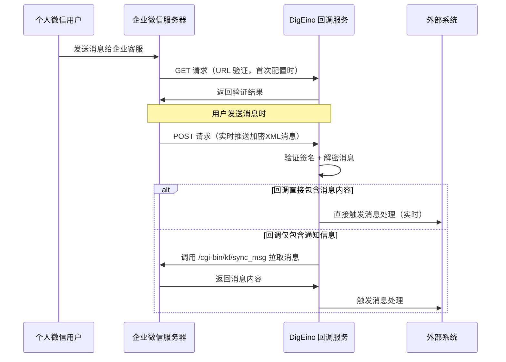

# 企业微信接收消息工具实现方案

## 一、需求分析

### 1.1 现有功能

- ✅ 已有发送工具：`send_wecom_customer_message`（企业微信 → 个人微信）
- ✅ 使用企业微信客服 API：`/cgi-bin/kf/send_msg`
- ✅ 配置系统：支持企业微信配置（CorpID、Applications、ManageAllKFSession）

### 1.2 需要实现的功能

- 🔄 接收个人微信 → 企业微信机器人应用的消息
- 🔄 企业微信客服回调机制（URL 验证 + 事件接收）
- 🔄 主动拉取消息接口（`/cgi-bin/kf/sync_msg`）
- 🔄 消息处理工具（供其他系统调用）

## 二、企业微信客服回调机制

### 2.1 实时通知机制（核心）

**企业微信确实有实时通知机制！** 当个人微信用户发送消息给企业微信机器人应用时，企业微信会**实时**通过 POST 请求将加密的消息推送到配置的回调 URL。

### 2.2 回调流程



### 2.3 回调消息格式

**GET 请求（URL 验证，首次配置时）**：

- `msg_signature`: 签名
- `timestamp`: 时间戳
- `nonce`: 随机数
- `echostr`: 加密字符串（需解密后返回）

**POST 请求（实时消息推送）**：

企业微信发送加密的 XML 消息：

```xml
<xml>
   <ToUserName><![CDATA[企业CorpID]]></ToUserName>
   <AgentID><![CDATA[应用ID]]></AgentID>
   <Encrypt><![CDATA[加密的消息内容]]></Encrypt>
</xml>
```

URL 查询参数：

- `msg_signature`: 签名
- `timestamp`: 时间戳
- `nonce`: 随机数

**解密后的消息内容**（可能包含两种情况）：

**情况1：直接包含消息内容**（推荐，实时获取）

```xml
<xml>
   <ToUserName><![CDATA[企业CorpID]]></ToUserName>
   <FromUserName><![CDATA[客户OpenID]]></FromUserName>
   <CreateTime>1234567890</CreateTime>
   <MsgType><![CDATA[text]]></MsgType>
   <Content><![CDATA[用户发送的消息内容]]></Content>
   <MsgId>消息ID</MsgId>
   <!-- 或其他消息类型：image, voice, video, file 等 -->
</xml>
```

**情况2：仅包含事件通知**（需要调用拉取接口）

```xml
<xml>
   <ToUserName><![CDATA[企业CorpID]]></ToUserName>
   <CreateTime>1234567890</CreateTime>
   <MsgType><![CDATA[event]]></MsgType>
   <Event><![CDATA[kf_msg_or_event]]></Event>
   <Token><![CDATA[用于拉取消息的token]]></Token>
   <OpenKfId><![CDATA[客服账号ID]]></OpenKfId>
</xml>
```

### 2.4 消息加解密

企业微信使用 **AES-256-CBC** 加密：

1. **验证签名**：`SHA1(sort(Token, timestamp, nonce, Encrypt))` == `msg_signature`
2. **解密消息**：使用 `EncodingAESKey`（43位Base64编码）进行 AES-CBC 解密
3. **解析 XML**：得到明文消息内容

### 2.5 拉取消息接口（备用方案）

如果回调仅包含通知信息，需要调用拉取接口：

**接口**：`POST /cgi-bin/kf/sync_msg`

**参数**：

- `access_token`: 具备「管理所有客服会话」权限的应用 token
- `token`: 回调事件中的 Token
- `limit`: 拉取数量（可选，默认 1000）
- `cursor`: 游标（可选，用于分页）

**返回**：最近 3 天内的消息列表

**注意**：此接口主要用于：

- 补拉历史消息（最近3天）
- 回调仅包含通知时的消息获取
- 主动查询场景

## 三、实现方案

### 3.1 配置扩展

在 `config/config.yaml` 的 `WeCom` 下新增回调配置：

```yaml
WeCom:
  Enabled: true
  CorpID: ""
  QYAPIHost: "https://qyapi.weixin.qq.com"
  TokenFilePath: "storage/app/wecom/access_token.json"

  # 新增：客服回调配置
  Callback:
    Enabled: false # 是否启用回调接收消息功能
    URL: "" # 回调 URL（如：https://your-domain.com/api/v1/wecom/callback）
    Token: "" # 回调 Token（企业微信管理后台配置）
    EncodingAESKey: "" # 回调消息加密密钥（企业微信管理后台配置）
    Path: "/api/v1/wecom/callback" # 回调路径（相对路径，用于路由注册）

  Applications:
    - AgentID: 0
      AgentSecret: ""
      ManageAllKFSession: false
```

### 3.2 新增类型定义

在 `tools/wx/wx_types.go` 中新增：

```go
// WeComCallbackEvent 企业微信客服回调事件
type WeComCallbackEvent struct {
    ToUserName string `json:"ToUserName"` // 企业微信CorpID
    CreateTime int64  `json:"CreateTime"` // 消息创建时间
    MsgType    string `json:"MsgType"`    // 固定为 "event"
    Event      string `json:"Event"`      // 固定为 "kf_msg_or_event"
    Token      string `json:"Token"`      // 用于拉取消息的token
    OpenKfId   string `json:"OpenKfId"`  // 客服账号ID
}

// SyncMessageRequest 拉取消息请求
type SyncMessageRequest struct {
    Token  string `json:"token"`  // 回调事件中的Token
    Limit  int    `json:"limit"`  // 可选，默认1000
    Cursor string `json:"cursor"` // 可选，用于分页
}

// SyncMessageResponse 拉取消息响应
type SyncMessageResponse struct {
    ErrCode      int           `json:"errcode"`
    ErrMsg       string        `json:"errmsg"`
    NextCursor   string        `json:"next_cursor"`   // 下次拉取的游标
    HasMore      int           `json:"has_more"`      // 是否还有更多消息
    MsgList      []CustomerMessage `json:"msg_list"`  // 消息列表
}

// CustomerMessage 客服消息
type CustomerMessage struct {
    MsgID         string                 `json:"msgid"`          // 消息ID
    OpenKfId      string                 `json:"open_kfid"`     // 客服账号ID
    ExternalUserID string                `json:"external_userid"` // 外部联系人ID（客户）
    SendTime      int64                  `json:"send_time"`     // 发送时间
    Origin        int                    `json:"origin"`        // 消息来源（3=客户发送）
    ServicerUserID string                `json:"servicer_userid"` // 客服userid（可选）
    MsgType       string                 `json:"msgtype"`       // 消息类型：text, image, voice, video, file, location, link, business_card, miniprogram, msgmenu, event
    Text          *TextMessage           `json:"text,omitempty"`
    Image         *MediaMessage          `json:"image,omitempty"`
    Voice         *MediaMessage          `json:"voice,omitempty"`
    Video         *MediaMessage          `json:"video,omitempty"`
    File          *MediaMessage          `json:"file,omitempty"`
    // ... 其他消息类型
}

// TextMessage 文本消息
type TextMessage struct {
    Content string `json:"content"` // 消息内容
    MenuID  string `json:"menu_id"` // 菜单ID（可选）
}

// MediaMessage 媒体消息（图片、语音、视频、文件）
type MediaMessage struct {
    MediaID string `json:"media_id"` // 媒体ID
}

// ReceiveWeComCustomerMessageRequest 接收消息工具请求（供外部系统调用）
type ReceiveWeComCustomerMessageRequest struct {
    OpenKfId      string `json:"open_kf_id"`      // 客服账号ID（可选，不传则拉取所有）
    ExternalUserID string `json:"external_userid"` // 外部联系人ID（可选，不传则拉取所有）
    Limit         int    `json:"limit"`           // 拉取数量（可选，默认1000）
    Cursor        string `json:"cursor"`           // 游标（可选，用于分页）
}

// ReceiveWeComCustomerMessageResponse 接收消息工具响应
type ReceiveWeComCustomerMessageResponse struct {
    Success   bool             `json:"success"`
    Message   string           `json:"message"`
    Messages  []CustomerMessage `json:"messages"` // 接收到的消息列表
    NextCursor string          `json:"next_cursor"` // 下次拉取的游标
    HasMore   bool             `json:"has_more"`   // 是否还有更多消息
}
```

### 3.3 新增回调处理模块

创建 `tools/wx/wecom_callback.go`：

**核心功能**：

1. **URL 验证**（GET 请求，首次配置时）：

- 验证签名（msg_signature）
- 解密 echostr
- 返回解密后的字符串

2. **实时消息接收**（POST 请求，核心功能）：

- 验证签名（msg_signature）
- **解密加密的 XML 消息**（使用 EncodingAESKey）
- **解析消息内容**：
  - 如果解密后直接包含消息内容（text、image、voice 等），**立即触发消息处理**（实时）
  - 如果解密后是事件通知（kf_msg_or_event），则调用拉取消息接口获取消息
- 触发消息处理回调（TODO：业务处理）

3. **消息拉取**（备用方案）：

- 实现 `SyncCustomerMessages()` 函数
- 调用 `/cgi-bin/kf/sync_msg` 接口
- 解析返回的消息列表
- 用于：补拉历史消息、回调仅包含通知时的消息获取、主动查询场景

**依赖**：

- 需要企业微信消息加解密库（推荐 `github.com/silenceper/wechat/v2/work` 或自行实现 AES-256-CBC 加解密）

### 3.4 新增接收消息工具

在 `tools/wx/wecom_tool.go` 中新增：

```go
// NewReceiveWeComCustomerMessageTool 创建接收企业微信客服消息工具
func NewReceiveWeComCustomerMessageTool(ctx context.Context) (tool.BaseTool, error) {
    // 检查配置
    // 返回工具实例
}
```

**工具名**：`receive_wecom_customer_message`

**描述**：接收个人微信用户发送给企业微信机器人应用的消息。支持两种模式：

1. **实时模式**：通过回调实时接收消息（推荐，消息即时到达）
2. **拉取模式**：主动拉取最近3天内的消息（用于补拉历史消息或主动查询）

**参数**：

- `open_kf_id`（可选）：客服账号ID
- `external_userid`（可选）：外部联系人ID
- `limit`（可选）：拉取数量，默认1000（仅拉取模式有效）
- `cursor`（可选）：游标，用于分页（仅拉取模式有效）
- `mode`（可选）：`"realtime"`（实时回调，默认）或 `"pull"`（主动拉取）

### 3.5 HTTP 服务器集成

**方案 A：DigEino 内置 HTTP 服务器**（如果已有）

在 HTTP 服务器中注册回调路由：

- `GET /api/v1/wecom/callback`：URL 验证
- `POST /api/v1/wecom/callback`：事件接收

**方案 B：提供回调处理器供外部系统集成**（推荐）

由于 DigEino 是插件，不强制要求内置 HTTP 服务器，可以提供：

1. **回调处理器函数**：供外部系统在 HTTP 框架中调用
2. **路由注册示例**：提供不同框架（Gin、Echo、标准库）的示例代码

### 3.6 工具注册

在 `tools/tools.go` 的 `BaseTools()` 函数中注册新工具：

```go
// 接收企业微信客服消息工具（如果已启用回调功能）
receiveTool, err := wx.NewReceiveWeComCustomerMessageTool(ctx)
if err == nil {
    tools = append(tools, receiveTool)
}
```

## 四、实现步骤

### 4.1 第一阶段：核心功能

1. ✅ 扩展配置结构（`config/config.go`）
2. ✅ 新增类型定义（`tools/wx/wx_types.go`）
3. ✅ 实现消息拉取接口（`tools/wx/wecom_callback.go`）
4. ✅ 实现接收消息工具（`tools/wx/wecom_tool.go`）
5. ✅ 注册工具（`tools/tools.go`）

### 4.2 第二阶段：回调处理

1. ✅ 实现 URL 验证（GET 请求处理）
2. ✅ 实现事件接收（POST 请求处理）
3. ✅ 实现消息加解密（使用企业微信标准算法）
4. ✅ 提供回调处理器函数（供外部系统集成）

### 4.3 第三阶段：业务处理（TODO）

1. ⏳ 消息处理回调接口设计
2. ⏳ 消息存储（可选）
3. ⏳ 消息过滤和路由（可选）
4. ⏳ 错误处理和重试机制

## 五、技术细节

### 5.1 消息加解密（核心）

企业微信使用 **AES-256-CBC** 加密，这是实时接收消息的关键：

**所需参数**：

- `Token`：回调 Token（企业微信管理后台配置）
- `EncodingAESKey`：43 位 Base64 编码的 AES 密钥（企业微信管理后台配置）
- `CorpID`：企业 ID

**加解密流程**：

1. **验证签名**：`SHA1(sort(Token, timestamp, nonce, Encrypt))` == `msg_signature`
2. **Base64 解码**：`EncodingAESKey` → 32字节 AES 密钥
3. **AES 解密**：使用 AES-256-CBC 模式，IV 取 AESKey 前16字节
4. **解析 XML**：得到明文消息内容

**推荐库**：

- `github.com/silenceper/wechat/v2/work`（企业微信 SDK，包含完整加解密实现）
- 或参考企业微信官方文档自行实现

### 5.2 实时消息处理优势

**实时回调模式**的优势：

- ✅ **即时性**：消息到达后立即推送，无需轮询
- ✅ **低延迟**：解密后直接获取消息内容，无需额外 API 调用
- ✅ **高效**：减少 API 调用次数，降低服务器压力
- ✅ **可靠性**：企业微信会重试失败的推送（最多3次）

### 5.3 消息拉取限制

- 最多拉取最近 3 天内的消息
- 单次最多 1000 条
- 不支持读取通过发送消息接口发送的消息（只能读取客户发送的）

## 六、配置示例

```yaml
WeCom:
  Enabled: true
  CorpID: "ww1234567890abcdef"
  QYAPIHost: "https://qyapi.weixin.qq.com"

  Callback:
    Enabled: true
    URL: "https://your-domain.com/api/v1/wecom/callback"
    Token: "your_callback_token"
    EncodingAESKey: "your_encoding_aes_key_43_chars_base64"
    Path: "/api/v1/wecom/callback"

  Applications:
    - AgentID: 1000001
      AgentSecret: "your_app_secret"
      ManageAllKFSession: true # 必须为 true，用于拉取消息
```

## 七、使用示例

### 7.1 外部系统集成回调（实时接收消息）

```go
// 使用 Gin 框架示例
import "github.com/originaleric/digeino/tools/wx"

func setupWeComCallback(r *gin.Engine) {
    callbackHandler := wx.NewWeComCallbackHandler()

    // 设置消息处理回调（业务逻辑）
    callbackHandler.OnMessage(func(msg wx.CustomerMessage) {
        // 实时处理接收到的消息
        fmt.Printf("实时收到消息: %s\n", msg.Text.Content)
        // TODO: 业务处理（存储、路由、自动回复等）
    })

    // URL 验证（首次配置时）
    r.GET("/api/v1/wecom/callback", callbackHandler.VerifyURL)

    // 实时消息接收（用户发送消息时，企业微信会实时推送）
    r.POST("/api/v1/wecom/callback", callbackHandler.HandleMessage)
}
```

**实时消息处理流程**：

1. 用户发送消息 → 企业微信实时推送加密 XML 到回调 URL
2. DigEino 回调处理器验证签名并解密消息
3. 如果解密后直接包含消息内容，立即触发 `OnMessage` 回调
4. 外部系统在回调中处理业务逻辑（实时响应）

### 7.2 主动拉取消息（补拉历史消息）

```go
import "github.com/originaleric/digeino/tools/wx"

func pullHistoryMessages(ctx context.Context) {
    req := wx.ReceiveWeComCustomerMessageRequest{
        Mode:  "pull", // 主动拉取模式
        Limit: 100,
    }

    resp, err := wx.ReceiveWeComCustomerMessage(ctx, req)
    if err != nil {
        log.Fatal(err)
    }

    for _, msg := range resp.Messages {
        fmt.Printf("拉取到消息: %s\n", msg.Text.Content)
        // TODO: 业务处理
    }

    // 如果还有更多消息，使用 next_cursor 继续拉取
    if resp.HasMore {
        req.Cursor = resp.NextCursor
        // 继续拉取...
    }
}
```

**使用场景**：

- 补拉历史消息（最近3天）
- 系统重启后同步消息
- 主动查询特定客服账号的消息

## 八、注意事项

1. **权限要求**：应用必须配置 `ManageAllKFSession: true`
2. **回调 URL**：必须是公网可访问的 HTTPS 地址（企业微信要求）
3. **实时性**：回调消息是实时推送的，需要在 5 秒内返回 HTTP 200，否则企业微信会重试（最多3次）
4. **消息时效**：
   - 实时回调：无时效限制（实时推送）
   - 主动拉取：只能拉取最近 3 天内的消息
5. **消息类型**：支持文本、图片、语音、视频、文件、位置、链接、名片、小程序等多种类型
6. **并发处理**：回调可能并发，需要做好并发控制和线程安全
7. **错误处理**：
   - 实时回调失败：企业微信会自动重试，但需要记录日志
   - 拉取消息失败：需要记录日志，避免丢失消息
8. **加解密性能**：消息加解密是同步操作，建议使用高效的加解密库，避免阻塞

## 九、后续扩展（可选）

1. **消息存储**：将接收到的消息存储到数据库
2. **消息路由**：根据消息内容路由到不同的处理逻辑
3. **自动回复**：基于接收到的消息自动回复
4. **消息统计**：统计消息数量、响应时间等指标
5. **Webhook 通知**：接收到消息后通知外部系统
