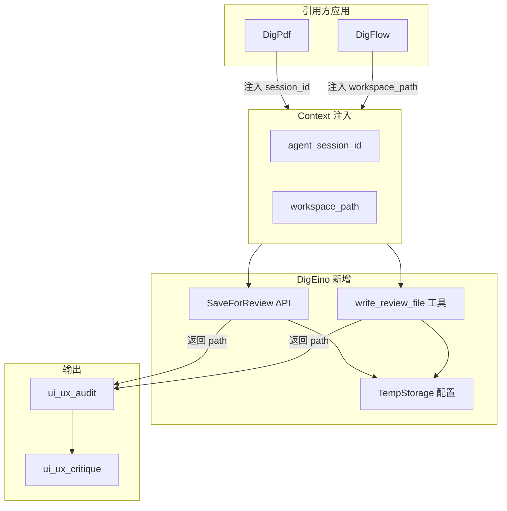

# 2026-03-18 临时存储统一方案

## 概述

在 DigEino 中新增临时文件存储能力（配置 + 程序化 API + LLM 工具），使 DigPdf、DigFlow 等引用方无需各自实现，统一通过 Context 注入和 DigEino 提供的工具完成 audit/critique 所需的路径类对接。

## 现状分析

| 应用 | 临时存储方式 | 实现位置 |
|------|--------------|----------|
| **DigPdf** | 会话级：`{BasePath}/storage/temp/agent/{sessionID}/{filename}` | `eino/pdf_agent.go` 的 `saveAgentTempFile` |
| **DigFlow** | 工作空间级：`{workspace_path}/{filename}` | `internal/service/engine/tools/file_tools.go` 的 `WriteFile` + `GetWorkspacePath` |

两者共同点：都需要「写入内容 → 得到路径 → 传给 ui_ux_audit / ui_ux_critique」。差异在于 DigPdf 用会话隔离，DigFlow 用用户 workspace。

## 方案目标

- 在 DigEino 中提供统一的临时存储能力
- 支持两种模式：**会话模式**（DigPdf）和 **工作空间模式**（DigFlow）
- 通过 Context 注入决定使用哪种模式，引用方无需再实现各自逻辑

## 架构设计



## 实施内容

### 1. 配置扩展

在 `config/config.go` 中扩展 `UIUXConfig`，新增临时存储配置：

```yaml
# config.yaml
UIUX:
  Storage:
    BaseDir: "storage/app/ui_ux"
  TempStorage:
    BaseDir: "storage/temp"   # 会话模式下的临时根目录，默认 storage/temp
```

- `BaseDir` 支持相对路径（相对于进程 cwd）或绝对路径
- 与 DigPdf 现有路径 `storage/temp/agent/{sessionID}` 兼容

### 2. 新增 pkg/storage 或 tools/storage

创建 `pkg/tempstorage`（或 `tools/storage`）包，提供：

**程序化 API**（供 DigPdf 等应用在代码中调用）：

```go
// SaveForReview 将内容写入临时文件，返回绝对路径供 audit/critique 使用
// ctx 需包含以下之一：
//   - workspace_path (string): 写入 workspace_path/filename
//   - agent_session_id (string): 写入 {BaseDir}/agent/{session_id}/{filename}
func SaveForReview(ctx context.Context, filename, content string) (path string, err error)
```

**Context 键约定**（与 DigFlow 兼容）：

- `workspace_path`：工作空间模式，DigFlow 已在使用
- `agent_session_id`：会话模式，DigPdf 需在调用 Agent 前注入

### 3. 新增 LLM 工具 write_review_file

在 `tools/tools.go` 的 `BaseTools` 中注册新工具：

- **名称**：`write_review_file`
- **参数**：`filename`（必填）、`content`（必填）
- **行为**：
  - 若 context 有 `workspace_path`：写入 `{workspace_path}/{filename}`，返回绝对路径
  - 否则若有 `agent_session_id`：写入 `{BaseDir}/agent/{session_id}/{filename}`，返回绝对路径
  - 否则返回错误，提示需注入 `workspace_path` 或 `agent_session_id`

该工具与 `ui_ux_audit`、`ui_ux_critique` 配合使用，LLM 可先调用 `write_review_file` 得到 path，再传给 audit/critique。

### 4. 可选：get_review_base_path 工具

若希望 LLM 能「先获取基础路径再自行拼接」，可增加：

- **名称**：`get_review_base_path`
- **参数**：无
- **行为**：从 context 解析 workspace_path 或 `{BaseDir}/agent/{session_id}`，返回基础目录绝对路径

DigFlow 已有 `get_workspace_path`，为减少重复，可约定：当 context 有 `workspace_path` 时，DigEino 的 `get_review_base_path` 直接返回该值，与 DigFlow 行为一致；无 workspace 时返回会话临时目录。也可不提供此工具，仅依赖 `write_review_file` 返回的完整路径。

### 5. 引用方改造

**DigPdf**：

- 在调用 Agent 的 context 中注入：`ctx = context.WithValue(ctx, "agent_session_id", sessionID)`
- 将 `saveAgentTempFile` 替换为 `tempstorage.SaveForReview(ctx, filename, content)`
- 删除 `eino/pdf_agent.go` 中的 `saveAgentTempFile` 及 `ExtensionKey*` 相关实现（或保留键名，仅改写入逻辑）
- Prompt 中引导：当有 `designer_css_path` / `html_output_path` 时可直接用；若需 LLM 自行写入再审查，可调用 `write_review_file`

**DigFlow**：

- 已注入 `workspace_path`，无需改动
- 可选择用 DigEino 的 `write_review_file` 替代自有的 `write_file`（仅针对审查流程），或保留现有 `write_file`，两种方式均可工作

### 6. 文档更新

- 在 `tools/ui_ux/README.md` 的「临时文件与工作空间集成」中补充：
  - Context 键说明：`workspace_path`、`agent_session_id`
  - 配置项：`UIUX.TempStorage.BaseDir`
  - 程序化 API：`tempstorage.SaveForReview`
  - 工具：`write_review_file`、可选 `get_review_base_path`

## 路径与兼容性

| 模式 | Context 键 | 存储路径 |
|------|------------|----------|
| 工作空间 | `workspace_path` | `{workspace_path}/{filename}` |
| 会话 | `agent_session_id` | `{BaseDir}/agent/{session_id}/{filename}` |

- DigPdf 当前：`{BasePath}/storage/temp/agent/{sessionID}/{filename}`
- DigEino 默认 BaseDir：`storage/temp`，完整路径为 `storage/temp/agent/{sessionID}/{filename}`
- 若 DigPdf 的 cwd 与 `variable.BasePath` 一致，则路径等价，可直接迁移

## 动态路径说明

方案已支持动态路径，核心在于：**动态部分由调用方注入，DigEino 只负责读取并使用**。

| 场景 | 注入方式 | 路径形态 |
|------|----------|----------|
| **DigPdf 会话级** | 每次会话注入 `agent_session_id`（如 sessionID） | `{BaseDir}/agent/{session_id}/{filename}`，不同会话不同目录 |
| **DigFlow 执行级（workspace）** | 每次执行注入 `workspace_path`（如 `/tmp/workspace/exec-uuid-xxx`） | `{workspace_path}/{filename}`，不同执行不同目录 |
| **DigFlow 执行级（session 模式）** | 每次执行注入 `agent_session_id`（如 executionUUID） | `{BaseDir}/agent/{execution_uuid}/{filename}`，不同执行不同目录 |

- DigEino 不生成 session_id 或 workspace_path，仅从 context 读取
- 调用方在每次会话/执行时注入不同的值即可实现隔离
- 若 DigFlow 暂无 workspace 概念，可改用 `agent_session_id` 注入执行级 UUID，实现与 DigPdf 类似的会话隔离

## 实施顺序建议

1. 配置扩展 + `pkg/tempstorage` 实现
2. `write_review_file` 工具实现并加入 BaseTools
3. 更新 README 与对接文档
4. DigPdf 迁移（替换 saveAgentTempFile）
5. DigFlow 评估是否采用 `write_review_file`（可选）

## 注意事项

- **BaseDir 解析**：优先使用配置的 `TempStorage.BaseDir`；若为空则默认 `storage/temp`；支持相对路径（相对 cwd）和绝对路径
- **安全性**：文件名需做安全校验，防止路径穿越（如禁止 `../`）
- **向后兼容**：DigFlow 的 `workspace_path` 键名保持不变，无需修改现有注入逻辑
