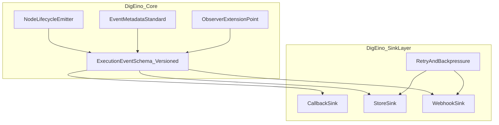

# 2026-03-28 DigEino执行事件底座升级方案

## 1. 目标与范围

- 目标：把 `DigEino` 升级为统一执行观测底座，让所有接入方获得一致的执行事件语义与稳定分发能力。
- 范围仅限 `DigEino` 库层，不包含平台治理与业务编排能力。
- 升级原则：
  - 只做“发生了什么”的标准化，不做“怎么管”的策略决策。
  - 对现有消费者保持向后兼容（只增不破）。
  - 先统一事件模型，再统一分发语义，最后做性能与稳定性加固。

## 2. DigEino内部目标架构

## 3. 能力清单（仅DigEino）

### 3.1 必做能力

- 统一 `ExecutionEvent` 数据结构，并加入 `schema_version`。
- 统一节点生命周期事件枚举：`started/succeeded/failed/retried/skipped/completed`。
- 统一元数据字段：`execution_id`、`node_id`、`attempt`、`timestamp`、`source`。
- 统一分发模型：`callback`（同步）、`store`（异步）、`webhook`（异步）。
- 增加 observer 扩展点，支持只观测不决策的插件化扩展。

### 3.2 明确不做

- 租户/用户/组织模型与鉴权策略。
- 任务领取、Run 状态机、人工干预 API。
- 审批、预算、告警、运营看板聚合。
- 业务审计留存策略与平台治理规则。

## 4. 升级路线图（DigEino专用）

### 阶段A：事件模型标准化（1-2周）

- 输出：统一事件 schema 与版本兼容约定。
- 关键动作：
  - 新增 `ExecutionEvent` 与 `schema_version`。
  - 固化字段字典与事件枚举，明确触发时机。
  - 保留旧接口，提供兼容包装层。
- 验收：旧消费者零改动可运行；新消费者可按统一 schema 解析。

### 阶段B：采集与分发统一化（1-2周）

- 输出：统一生命周期采集与 sink 分发语义。
- 关键动作：
  - 统一节点事件发射入口，保证 HTTP/CLI/批处理入口语义一致。
  - 打通 `callback/store/webhook` 分发链路，统一错误处理与重试行为。
  - 增加事件去重键建议（如 `execution_id + node_id + attempt + event_type`）。
- 验收：同一执行在三类 sink 的事件口径一致，异常情况下不丢关键事件。

### 阶段C：稳定性与发布加固（1-2周）

- 输出：可对外发布的稳定版本与迁移指南。
- 关键动作：
  - 加入 payload 限制、采样与脱敏策略。
  - 增加回归测试：向后兼容、事件顺序、重复投递、失败重试。
  - 发布迁移文档（旧字段到新 schema 的映射表）。
- 验收：性能与兼容回归通过；有明确升级说明与回滚方案。

## 5. 验收标准（最终）

- 事件语义一致：各入口触发的生命周期事件名称与时机一致。
- 兼容稳定：旧消费者无需改造即可继续消费。
- 分发可靠：sink 故障可重试、可观测、可降级。
- 可扩展：新增事件字段不破坏旧版本解析逻辑。

## 6. 风险与控制

- 事件语义漂移（文档与实现不一致）。
  - 控制：先冻结事件字典，再实现；测试用例与字典一一映射。
- 兼容性回归（历史消费者解析失败）。
  - 控制：只增字段不删旧语义，版本字段必填，灰度验证。
- 事件风暴（高频节点导致负载异常）。
  - 控制：采样、节流、异步队列与大小限制。
- 外部依赖不稳定（webhook 下游抖动）。
  - 控制：重试退避、死信记录、告警与手动补偿通道。

## 7. 优先级

- P0：事件 schema + 生命周期枚举 + 元数据标准化。
- P1：采集入口统一 + 三类 sink 语义统一。
- P2：稳定性加固 + 迁移文档 + 发布治理。

## 8. 参考文档

- `/Users/dig/Documents/文稿 - XinYe的MacBook Pro (5)/Projects/AI/Cursor/dev/2026-03-27_DigEino下沉平台能力可行性分析与分层方案.md`
- `/Users/dig/Documents/文稿 - XinYe的MacBook Pro (5)/Projects/AI/Cursor/dev/2026-03-25_Edict与DigFlow对比及治理层编排方案.md`
- `/Users/dig/Documents/文稿 - XinYe的MacBook Pro (5)/Projects/AI/Cursor/dev/2026-03-27_DigFlow借鉴Paperclip能力对照与实施方案.md`
