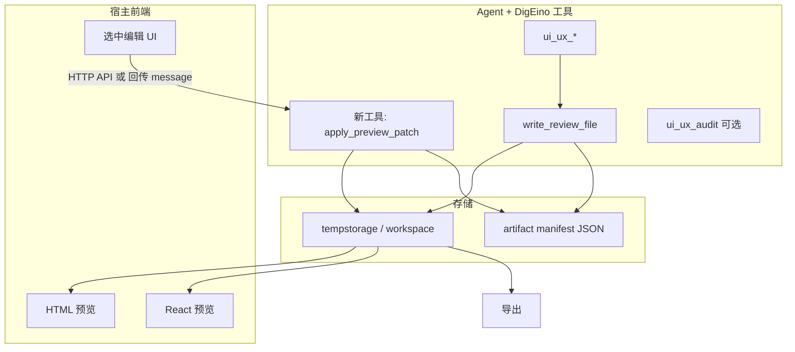

# 2026-03-28 UI 预览与用户编辑工具方案

**实施状态（DigEino 库）**：已提供 `write_preview_manifest`、`apply_preview_patch`、`export_preview_bundle`（见 `tools/ui_ux/preview_*.go`）及 `tempstorage.SaveBytesForReview`；并补充 `artifact_id` 寻址、`History` 快照与 `AllowedExtensions` 配置。宿主 iframe/Sandpack 仍为引用方集成项。

本文档定义 DigEino 下一阶段需求：在 Agent 结合 `ui_ux` 工具生成实现代码后，提供静态 HTML 与 React 两条预览链路、前端可视化微调，并将用户修改抽象为可注册的 LLM 工具（结构化 Patch + 既有临时存储），最终支持导出与可选再审查。

## 1. 目标与边界

**目标**

- Agent 在调用 `ui_ux_search` / `generate_design_system` / `persist_design_system` 等工具并完成**实现代码生成**（由模型写出 HTML 或 React 源码，仍通过现有 [`write_review_file`](../../tools/storage/write_review_file.go) / [`pkg/tempstorage`](../../pkg/tempstorage/tempstorage.go) 落盘）后，**宿主前端能预览**。
- 用户在预览中**点击文案/图片等**做有限范围的修改；修改**不直接靠模型猜**，而是落成**结构化 Patch**，由新工具写回文件并刷新预览。
- 支持**导出**（下载 zip、或工作区内最终路径、或再调 `ui_ux_audit` / `ui_ux_critique`）。

**不在本阶段一次做完的（Backlog）**

- 任意 DOM 的无限编辑（等同于可视化 IDE）；复杂 JSX 结构拖拽。
- 无沙箱的任意 `dangerouslySetInnerHTML` 执行不受信代码。

## 2. 总体架构



**约定**：每一次「可预览的产物」对应一个 **Artifact**（一次会话内可多个版本），由 **manifest** 描述类型、主文件路径、资源列表、内容块 ID（见下）。

## 3. 产物形态：静态 HTML 与 React

### 3.1 静态 HTML 轨道（P0，优先落地）

| 项 | 建议 |
|----|------|
| **生成约束（Prompt / 规范）** | 要求模型输出「单页或少量 HTML」：关键区块带稳定的 `data-uiux-id`，图片用可替换的 `src` 或占位；外链脚本受限。 |
| **预览** | 前端 `iframe` + `srcdoc` 或服务端静态文件 URL（同域）读取 `preview.html`；CSP 限制脚本。 |
| **可编辑范围** | 初始：**文本节点替换**、**指定 `img` 的 `src`/`alt`**、可选 **带 id 的块**整体替换 HTML 片段。 |
| **Patch** | 见第 4 节；应用后写回 `index.html` 或约定文件名。 |

### 3.2 React 轨道（P1，分档实现）

**分档 A（推荐先做）：内容驱动 + 预览壳**

- 模型除组件外再生成一份 **`content.json`**（或 TS 常量文件），文案、图片 URL、CTA 等全部从数据渲染；用户编辑只改 **内容模型**，Patch 针对 JSON 路径（如 `$.hero.title`）。
- 预览：宿主用 **Sandpack**（`@codesandbox/sandpack-react`）或自建 Vite 沙箱，入口组件读 `content.json`；改 JSON → 热更新，**不碰 AST**。

**分档 B（增强）：源码级 Patch**

- 对 `page.tsx` 等做**受控替换**（例如仅允许替换字符串字面量、或模型预置 `// @uiux-editable` 标记区间）；由新工具在校验后写回。
- 复杂度高，建议在 A 稳定后再做。

**与 shadcn**：若 UI 为 shadcn 组件，分档 A 最合拍（组件结构固定，变的是 props/children 绑定的数据）。

## 4. 新工具抽象：`apply_preview_patch`（名称可定）

**职责**：接收结构化修改清单 → 校验 → 应用到已存在的 Artifact 文件 → 更新 manifest 版本 → 返回新路径/版本号供前端刷新与 Agent 续聊。

**建议参数（JSON schema 思路）**

- `artifact_ref`：manifest 路径，或 `session` + `artifact_id`。
- `base_revision`：乐观锁，防止并发覆盖。
- `patches`：数组，元素类型区分 `html` / `content_json` / `react_source`（可选）：
  - **HTML**：`{ "type": "html_text", "selector": "[data-uiux-id=hero-title]", "text": "..." }`、`{ "type": "html_attr", "selector": "...", "attr": "src", "value": "..." }`。
  - **内容模型**：`{ "type": "json_pointer", "pointer": "/hero/title", "value": "..." }`（RFC 6901 或简化子集）。
  - **源码（B 档）**：`{ "type": "literal_replace", "file": "app/page.tsx", "old": "...", "new": "..." }`（必须长度与上下文校验）。

**行为**

- 读取 manifest，定位文件绝对路径（继承 [`write_review_file`](../../tools/storage/write_review_file.go) 的路径规则：`workspace_path` 或 `agent_session_id`）。
- 应用 Patch（HTML 可用 goquery 等；JSON 用标准库或 `json-patch`）。
- 写回文件，`revision++`，可选写 `history/` 片段便于回滚。
- 返回：`{ "ok", "revision", "updated_files": [...] }`。

**安全**

- 路径必须在 manifest 允许列表内，禁止 `..` 逃逸。
- `literal_replace` 必须 `old` 唯一匹配且白名单后缀（`.tsx` / `.jsx`）。

**Agent 侧**：用户在前端改完后，宿主可将同一 Patch **注入对话**（用户消息或 tool_result），或前端直接调后端 API 调工具；Agent 无需「看见」iframe，只需知道 revision 与路径即可继续 `ui_ux_audit`。

## 5. Manifest（建议新增小文件规范）

由 **`write_preview_manifest`**（可与 `write_review_file` 合并为一次工具调用，或独立程序 API）在模型写完主文件后写入，例如 `preview-manifest.json`：

```json
{
  "artifact_id": "uuid",
  "kind": "static_html",
  "revision": 3,
  "entry": "preview/index.html",
  "assets": ["preview/logo.png"],
  "editable_model": null
}
```

React 分档 A 示例：`"kind": "react_sandpack"`，`"entry"` 为入口列表或 zip 内路径，`"editable_model": "preview/content.json"`。

## 6. 宿主前端职责（DigFlow / DigPdf / 自建控制台）

- **预览区**：HTML iframe；React Sandpack iframe。
- **编辑交互**：点击拾取 `data-uiux-id` 或 Sandpack 自定义面板绑定 JSON 字段；生成 **Patch 列表**。
- **保存**：调用承载 DigEino 工具的 **后端** 执行 `apply_preview_patch`（或等价 RPC）；刷新预览 URL（可加 `?rev=`）。
- **导出**：打包 manifest 中 `entry` + `assets` 为 zip，或复制到用户 workspace 固定目录。

## 7. 与现有 ui_ux 工作流衔接

1. `generate_design_system` / `ui_ux_search` → 模型生成代码 → `write_review_file` 写入 `preview/*`。
2. **（新）** 宿主或辅助步骤写入 `preview-manifest.json`。
3. 前端预览；用户微调 → **`apply_preview_patch`**。
4. 可选：`ui_ux_audit` / `ui_ux_critique` 指向更新后的主文件路径。
5. 导出。

## 8. 实施阶段（建议）

| 阶段 | 内容 |
|------|------|
| **P0** | HTML：manifest 约定 + `apply_preview_patch`（`html_text` / `html_attr`）+ 前端 iframe + 导出 zip；Prompt 规范 `data-uiux-id`。 |
| **P1** | React：Sandpack + `content.json` + Patch `json_pointer`；热更新预览。 |
| **P2** | 源码级 `literal_replace`（可选）、版本回滚 UI、与 audit 流水线一键触发。 |

## 9. DigEino 仓库内改动清单（执行阶段参考）

- 新包或新文件：例如 [`tools/ui_ux/`](../../tools/ui_ux/) 下 `patch_tool.go`（或 `tools/preview/`）实现 `apply_preview_patch`；可选 `register_preview_manifest`。
- [`tools/tools.go`](../../tools/tools.go) 注册新工具。
- 配置：可在 [`config/config.go`](../../config/config.go) 的 `UIUX` 下增加 `Preview.MaxFileSize`、`Preview.AllowedExtensions` 等（执行时可细化）。
- 文档：更新 [`tools/ui_ux/README.md`](../../tools/ui_ux/README.md) 中「预览与 Patch」章节。

## 10. 关键设计原则

- **编辑结构化**：前端产生 Patch，工具只做确定性应用，减少模型编造路径的风险。
- **双轨一致**：HTML 与 React 共用同一套「revision + manifest + patch 工具」思想，仅 Patch 类型与预览壳不同。
- **复用已有能力**：路径与会话仍依赖现有 **Context 注入** 与 **tempstorage**，与 [2026-03-18 临时存储统一方案](./2026-03-18_临时存储统一方案.md) 一致。

## 11. 跟踪项（可选）

- P0：定义 `preview-manifest.json` 与 HTML 生成约定（`data-uiux-id`）。
- P0：实现 `apply_preview_patch`（`html_text` / `html_attr` + 路径校验 + revision）。
- P0：宿主前端 iframe 预览 + Patch 提交 API + 导出 zip。
- P1：React Sandpack + `content.json` + `json_pointer` Patch。
- P2（可选）：源码 `literal_replace`、回滚、audit 一键触发。
