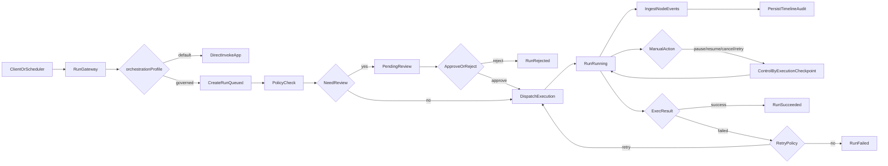

# 2026-03-29 DigFlow 平台治理 Workflow 与按 App 拦截策略方案

## 背景

基于近期对 `edict` / `paperclip` / `DigFlow` 的对照讨论，目标是明确：

- 是否可在不影响业务 app 的前提下增加平台治理层；
- 如何通过 API 获取每个 agent 运行状态；
- `governed` 模式与审计/拦截关系；
- 不同 app 节点字段不一致时，拦截策略如何配置与落地路径。

## 核心结论

1. 可以在 DigFlow 现有业务 app 之上增加治理外层（Governance Overlay）。
2. 通过统一 Run/Timeline API 获取运行状态，不要求 app 自行拼装状态。
3. `governed` 启用后进入治理流程与审计链路；`default` 保持原链路兼容。
4. 审计默认旁路记录，不强制中断；只有命中 Gate 策略才会阻塞。
5. 拦截策略应支持按 app 单独配置，采用“全局默认 + app 覆盖 + 请求覆盖”三层优先级。

---

## 一、治理分层建议

### 1) DigEino（执行事件底座）

- 负责“发生了什么”：`execution_id`、节点生命周期事件、事件分发。
- 提供标准化事件，不承载租户治理、审批预算、运营面板等平台语义。

### 2) DigFlow（治理与控制面）

- 负责“该怎么管”：Run 状态机、策略评估、审计事件、人工干预、恢复语义。
- 对 app 暴露统一治理 API 和运行观测 API。

### 3) App 层（业务）

- 仅关注业务流程与领域模型。
- 不重复实现状态机治理、审计聚合、干预控制等平台能力。

---

## 二、平台治理 Workflow（低侵入）

---

## 三、Run 状态与 API 口径

### Run 状态（建议）

- `queued -> pending_review -> dispatching -> running -> succeeded|failed|cancelled|rejected`
- 恢复态：`running -> stale -> requeued`

### 最小 API（建议）

- `POST /api/v1/runs`：创建并触发运行（支持 `orchestration_profile`）
- `GET /api/v1/runs/{run_id}`：查看当前状态与摘要
- `GET /api/v1/runs/{run_id}/timeline`：查看节点事件、人工动作、状态跃迁
- `POST /api/v1/runs/{run_id}/actions`：`approve|reject|pause|resume|cancel|retry|restart_from_node`

---

## 四、关键问答口径（统一对外解释）

### Q1：是否通过 API 获取每个 agent 运行状态？

是。统一通过 Run/Timeline API 提供状态，不依赖各 app 自行实现状态拼接。

### Q2：app 设置为 `governed` 是否自动进入治理流程与审计？

是。`governed` 启用治理状态机、审计记录和可选策略关卡；`default` 保持旧行为。

### Q3：启用治理/审计后，是否一定在节点中断？

不一定。默认是“审计不停流”，仅当命中 Gate Policy 才中断并等待审批/指令。

---

## 五、按 App 拦截策略（解决节点字段不一致）

### 设计原则

- 先做事件标准化标签，再做策略匹配，避免直接耦合 app 私有字段。
- 策略动作分为三类：`audit_only`、`gate`、`alert`。

### 标准化标签（建议）

- `app_id`
- `node_key`
- `node_type`
- `tool_name`
- `event_type`
- `risk_level`

### 策略优先级（建议）

1. Request 级临时覆盖（最高）
2. App 级策略
3. Global 默认策略（兜底）

---

## 六、配置路径建议

结合当前仓库已有配置习惯（`config/*.yml` + `app/*/config/agent.yml`），建议新增：

- 全局策略：`config/governance.yml`
- App 策略：`app/<app_id>/config/governance.yml`
- 请求覆盖：`POST /api/v1/runs` 的 `policy_overrides` 字段

说明：

- 当前仓库尚未看到独立治理策略文件，属于下一阶段扩展项。
- 建议先引入全局默认，再给一个试点 app（如 `ui_pro` 或 `researcher`）增加 app 级覆盖。

---

## 七、落地顺序（最小闭环）

1. 定义并冻结 Run 状态机与合法跳转。
2. 上线 Run API（`default|governed` 双模式）与 timeline 存储。
3. 接入人工动作 API（暂停/恢复/取消/重试/节点续跑）。
4. 增加 `config/governance.yml` 与 `app/<id>/config/governance.yml` 解析。
5. 灰度到 1 个 app，验证无业务回归后推广。

---

## 八、与现有对照分析文档关系

- 对照结论来源：
  - `2026-03-25_Edict与DigFlow对比及治理层编排方案.md`
  - `2026-03-27_DigFlow借鉴Paperclip能力对照与实施方案.md`
  - `2026-03-27_DigEino下沉平台能力可行性分析与分层方案.md`

本文档用于把讨论结果沉淀为可执行治理方案和统一口径说明。
