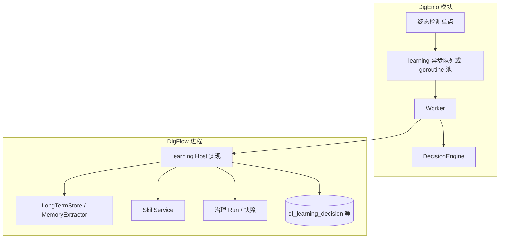

# 2026-04-12 DigEino 优先：PostRun 自进化 Learning 落地方案

> 背景与动机见 [Hermes 与 OpenClaw 对比及 DigFlow 自进化强化方案](2026-04-09_Hermes与OpenClaw对比及DigFlow自进化强化方案.md)。本文是在该文基础上，将 **PostRun Learning Loop** 改为 **先在 DigEino 代码库落地、DigFlow 作宿主适配** 的可执行方案备忘。

## 定位说明

当前 DigFlow 通过 `github.com/originaleric/digeino`（见仓库根目录 `go.mod`）依赖 DigEino：**DigEino 是库而非独立进程**。「直接落地 DigEino」指在 **DigEino 源码仓库** 中实现通用 `learning` 子系统并发版；DigFlow 升级依赖后，在进程内注册 **宿主适配器**，把沉淀写回 DigFlow 已有的 Memory / Skills / 审计存储。

## DigEino 侧交付物（主战场）

1. **包结构（建议）**  
   - `learning/types.go`：`LearningEvent`、`RunContext`、`LearningDecision`、动作结构体（与背景文档附录 A 对齐）。  
   - `learning/config.go`：阈值、`enabled`、异步、`min_tool_calls`、`min_confidence`、`patch_first`、重试。  
   - `learning/host.go`：**仅接口** — `Host` 或拆分为 `RunContextProvider`、`MemorySink`、`SkillSink`、`LearningAuditStore`（宿主实现，DigEino 不碰业务库表细节）。  
   - `learning/engine.go`：规则过滤 + 可选 `LLMClient` 接口注入，产出结构化决策 JSON。  
   - `learning/worker.go`：`Handle(event)` — 拉上下文 → 决策 → 按阶段执行动作 → 审计回调。

2. **终态触发（必须在 DigEino 内收敛为单点）**  
   避免 DigFlow 与 DigEino 各触发一次。优先在 **写入 execution 终态** 的路径上注册（与现有 DigFlow 中 [`status`](../../internal/http/controller/webhook/webhook_controller.go) / [`StatusCollector`](../../internal/http/controller/agent/status_collector_builder.go) 管线一致）：例如 `StatusStore` 在判定 `completed/succeeded/failed` 且 `EndTime` 落盘之后，若配置启用则 `go learning.Enqueue(...)`。  
   具体函数名以 DigEino 仓库现状为准；原则是 **与 DigFlow 是否走 `finalizeInvokeSuccess` 无关**，以 **execution_id** 为幂等键之一。

3. **幂等**  
   DigEino Worker 侧：`execution_id` + `terminal_outcome` 去重；宿主 `LearningAuditStore` 可实现「已存在则跳过」。

4. **版本与发布**  
   DigEino 发 `v1.x` 次版本；DigFlow `go get` 升级并处理破坏性变更（若有）。

## DigFlow 侧交付物（变薄）

1. **`learning.Host` 实现**  
   - **RunContext**：优先用 `execution_id` 关联治理 Run（[`governance.Repository`](../../internal/service/engine/governance/repository.go)）、`InvokeRequestJSON`；若同请求尚有内存中的 `InvokeResponse`，可作为增强字段注入（需 DigEino `Host` 接口支持附加载荷或通过扩展 `LearningEvent`）。  
   - **Memory / Skill**：直接调用现有 [`MemoryExtractor` / `LongTermStore`](../../internal/service/engine/memory/extractor.go)、[`SkillService`](../../internal/service/engine/skills/service_impl.go)（patch → `UpdateSkill`）。  
   - **Audit**：写入 `df_learning_*` 表或现有治理扩展。

2. **bootstrap 注册**  
   在 [`bootstrap/common/init.go`](../../bootstrap/common/init.go) 或治理初始化处：`learning.SetHost(...)` 或 DigEino 提供的注册 API（由 DigEino 设计）。

3. **可选补钩**  
   若存在 **仅 DigFlow 知晓** 的终态（例如未经过 DigEino status 存储的极少数路径），可保留一处 `Enqueue` 与 DigEino 幂等协作 —— 以评审为准，理想状态是 **零补钩**。

4. **HTTP API**  
   审计查询/回滚仍在 DigFlow（业务数据在此），路由风格不变。

## 数据与配置归属

| 内容 | 建议 |
|------|------|
| learning 行为开关与阈值 | DigEino `config` 统一加载（与现有 `digeino/config` 模式一致），DigFlow `config.yml` 可映射或覆盖 |
| 审计表 | 留在 DigFlow DB，由 Host 写入 |
| 决策与 job 队列 | 内存队列可在 DigEino；持久化 job 若需跨进程再引入 Redis —— MVP 用进程内 + DB 幂等即可 |

## 分阶段验收（与背景文档阶段对应）

| 阶段 | DigEino | DigFlow |
|------|---------|---------|
| 0 | 开关默认 off；日志 | 注册空 Host 或 no-op |
| 1 | Worker + Engine 只写审计（经 Host） | 实现 AuditStore；全链路打通 |
| 2 | 执行 memory_actions | Host 调 LongTermStore |
| 3 | 执行 skill_actions | Host 调 Create/UpdateSkill |
| 4 | 指标钩子（可选回调接口） | 监控与灰度 app |

## 实施任务清单（备忘）

- [ ] 在 digeino 仓库新增 `learning` 包（类型、Config、DecisionEngine、Worker、Host 接口）；配置并入 digeino 现有 config 加载  
- [ ] 在 digeino 内于 execution 终态唯一路径挂载异步学习调度，保证幂等与可关闭  
- [ ] DigFlow 实现 `learning.Host`（RunContext 来自治理 Run + 可选 InvokeResponse；Memory/Skill/Audit 调现有服务与表）  
- [ ] bootstrap 注册 Host、启用 learning  
- [ ] `df_learning_decision` 等表与查询/回滚 API；分阶段 rollout 开关与阈值  

## 风险与依赖

- **DigEino 仓库访问与发版节奏**：需要在该仓库开分支/PR，与 DigFlow 升级锁步。  
- **上下文完整性**：纯 Webhook 终态路径须在 Host 内用 Run 快照 + 可选 execution 履历拼装。  
- **循环依赖**：`learning` 包仅依赖 DigEino 内部抽象与标准库 + 最小接口；**不得** import DigFlow。

## 与背景文档第九章的关系

原文「先 DigFlow MVP 再下沉」改为 **先 DigEino 核心再 DigFlow 适配**；附录 A 接口由 DigEino 正式提供，DigFlow 成为首个宿主而非临时实现方。
