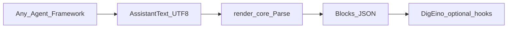
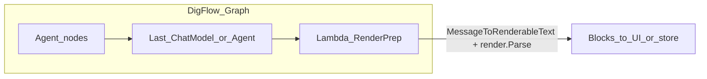

# 2026-04-24 DigEino 通用 LLM 聊天渲染 pkg 设计方案

> 本文同步自内部规划：将 **助手输出结构化渲染** 设计为 **非模型 Tool** 的宿主管线；核心可单独开源；体验对齐 **Cursor 式流式展示** + **终态 Parse**；并说明在 **DigFlow**（基于 Eino 的多 Agent 编排）中的对接方式。

## 背景与定位

- DigEino 仓库内当前以根目录 [go.mod](../../go.mod)、[tools/tools.go](../../tools/tools.go)、[webhook/status_collector.go](../../webhook/status_collector.go) 等为上下文。
- **产品体验参照 Cursor**：边吐边渲染在宿主；**终态**再做结构化分块（落库、观测、导出）。
- **与 Tool 的边界**：渲染不是模型可调用的 `tool.BaseTool`，而是宿主侧管线。

## 开源与模块边界（与 Eino / 任意 Agent 解耦）

目标：**这一块可以单独开源**，不绑定 CloudWeGo Eino；**任何 Agent 架构**（LangGraph、自研编排、Python 服务只要愿意调 Go 库或通过 JSON 契约对接）都能用。

| 层级 | 内容 | 依赖 |
|------|------|------|
| **核心库**（可独立 repo / module） | `Parse(raw string, opts...) → []Block`、类型定义、可选 `ToHTML`、可选增量解析 | **禁止**依赖 `eino`；仅标准库 + 明确列出的 MD/安全相关库 |
| **适配与集成**（留在 DigEino 或各宿主自写） | 从 `schema.Message` 拼出 `string` 再 `Parse`；`tempstorage` 写文件；`StatusCollector` 钩子 | 仅 DigEino 侧引用 eino |
| **跨语言** | 核心若仅 Go：其他栈可通过 **CLI stdin/stdout JSON** 或 **WASM** 复用（后续可选），不在首版强制 | — |

实施上二选一即可：

- **A**：先在本仓库 `pkg/render/` 开发，**go.mod 用 `replace` 或子模块**将来抽到 `github.com/xxx/llm-render`；或
- **B**：一开始就新建独立 module，DigEino `require` 该模块。

DigEino 文档中说明：**集成只需传入助手最终文本（或等价 UTF-8 字符串）**，与编排框架无关。

### DigEino 仓库内路径约定（`pkg/render`）

当前 DigEino 是**单模块**根目录 [go.mod](../../go.mod)。渲染相关代码放在 **`pkg/render/`** 树下（与 [tools/](../../tools) 等同级的是 **`pkg/`** 目录，而非根目录裸 `render/`）。

| 路径 | 包职责 | import 路径（示例） |
|------|--------|---------------------|
| **`pkg/render/`** | **核心**：`package render`；无 eino；`Parse`、`Block`、`Options` | `github.com/originaleric/digeino/pkg/render` |
| **`pkg/render/html/`**（可选） | 纯 `ToHTML` 等，仍不引用 eino | `github.com/originaleric/digeino/pkg/render/html` |
| **`pkg/render/eino/`** | **子包**（如 `package rendereino`）：`schema.Message` → 字符串 → 调核心 `render.Parse` | `github.com/originaleric/digeino/pkg/render/eino` |

**Eino 适配能否也放在 `pkg/render` 下？** **可以**，但必须是 **独立子目录 + 独立 package**（上表 `pkg/render/eino`），**不能**与核心混在同一个 `pkg/render` 的 `package render` 源文件里——否则要么核心被迫 `import eino`，要么违背「核心可单独开源、零 eino」的边界。子包依赖 eino 只影响「含该子包的 module」；将来拆仓时可只迁走 `pkg/render` 与 `pkg/render/html`，**留下或删除** `pkg/render/eino` 由 DigEino 维护亦可。

**不要**放在 [tools/](../../tools) 下：语义上仍是宿主管线，非模型 Tool。

文档与示例中的 import 统一改为 `github.com/originaleric/digeino/pkg/render`（及 `.../pkg/render/eino`）。

## 流式 vs 终态（职责划分）

| 阶段 | 典型做法 | 核心库 / DigEino |
|------|----------|------------------|
| 流式中 | 宿主 buffer + 增量 UI | 核心库不强制参与；可选 Phase D 增量 API |
| 流式结束 | `Parse` 终态字符串 | **核心库** |



## 目标能力（产品层）

| 能力 | 说明 |
|------|------|
| 分块解析（终态） | 完整文本 → Markdown 段、代码围栏、思考区等 |
| 稳定 JSON | `[]Block`，便于任意下游 |
| 可选 ToHTML | 在核心或 `pkg/render/html` 子包，避免拉 eino |
| 流式体验 | Cursor 式由宿主负责；文档 + 可选增量 API |

## DigEino 专属衔接（薄）

- 从 `*schema.Message` 提取 `Content`（及如需则序列化 `tool_calls` 为可读附录）→ 调用核心 `Parse`。
- [StatusCollector.OnComplete](../../webhook/status_collector.go)、Graph 结束回调等：**仅 DigEino**。
- [tools/wx](../../tools/wx)、`tempstorage`：**集成代码**，不属于必须开源的核心最小集。

## 实施阶段（建议）

1. **Phase A — 核心库**：无 eino；`Parse` + 单测。
2. **Phase B — ToHTML（可选）**：纯函数为主；DigEino 写文件另包一层。
3. **Phase C — DigEino 薄适配**：`pkg/render/eino`；Message → string → `Parse`；观测钩子示例。
4. **Phase D — 流式辅助（可选）**：核心内增量 API。
5. **Phase OSS — 单独开源**：模块路径、README、与 DigEino 的 `require` 关系。

## 风险与约束

- **go.mod 纪律**：核心包 CI 应用 `grep` 或 `go mod` 检查，防止误引入 eino。
- **流式与终态**：产品两条路径并存。
- **模型格式漂移**：思考标签配置化。
- **[tools/ui_ux/reasoning.go](../../tools/ui_ux/reasoning.go)** 与聊天渲染无关。

## DigFlow 对接示例（独立核心 vs 基于 Eino）

DigFlow 基于 Eino 做多 Agent 编排时，渲染仍放在 **「模型输出已产生之后」**，不注册为 Tool。下面两种用法共用**同一套核心 API**（模块路径实现时可能是独立 repo，或暂为 `github.com/originaleric/digeino/pkg/render`，下文记为 `render`）。

### 共同前提

- `go.mod`：`require` 渲染核心模块（**该模块不依赖 eino**）。
- **流式**：DigFlow / ChatModel `Stream` 仍将 chunk 推给前端做 Cursor 式展示；**流结束**后再对拼好的正文调用一次 `Parse`（或与流并行仅用于调试，视产品而定）。
- **终态输入**：一律是 UTF-8 的助手可见文本字符串（必要时在适配层把 tool 轨迹拼进附录再 Parse）。

### 方式一：完全独立（只把 DigEino 当「字符串进、块出」的库）

编排里任意一步只要拿到 **最终要展示的字符串**（无论从哪个 Agent、是否经过 Eino），直接调用核心包即可；**不引用** `schema.Message`。

```go
import "github.com/originaleric/digeino/pkg/render" // 或未来独立 module 路径

func AfterOrchestration(assistantPlainText string) ([]render.Block, error) {
    return render.Parse(assistantPlainText, render.Options{
        // ThinkingTagPairs, CodeFence rules 等
    })
}
```

典型挂载点（DigFlow 侧任选其一）：

- 多 Agent **Supervisor / Router** 汇总出最终 `string` 后的一个「后处理」函数；
- 工作流 **出口节点**（export / persist / API response 组装）里调用 `Parse`，把 `[]Block` 或序列化 JSON 交给网关、DB、前端；
- HTTP handler：编排 `Invoke` 返回后，从响应 DTO 里取 `AssistantText` 再 `Parse`。

**特点**：DigFlow 对 eino 的用法不变；渲染与 Graph 形状解耦，最适合将来把 `render` 拆到独立开源仓。

### 方式二：基于 Eino 消息（在 Graph 里接在 ChatModel / Agent 后面）

在 **返回 `*schema.Message`（或 `[]*schema.Message`）的节点之后**加一个 Lambda（或 DigFlow 的等价「后处理节点」）：从 Message 抽出正文，可选附加 tool 调用摘要，再调用同一 `render.Parse`。

```go
import (
    "strings"

    "github.com/cloudwego/eino/schema"
    "github.com/originaleric/digeino/pkg/render"
)

// MessageToRenderableText 也可直接使用 DigEino 提供的 pkg/render/eino 子包中的辅助函数。
func MessageToRenderableText(msg *schema.Message) string {
    if msg == nil {
        return ""
    }
    var b strings.Builder
    b.WriteString(msg.Content)
    if len(msg.ToolCalls) > 0 {
        b.WriteString("\n\n<!-- tool_calls -->\n")
        for _, tc := range msg.ToolCalls {
            b.WriteString(tc.Function.Name)
            b.WriteString(": ")
            b.WriteString(tc.Function.Arguments)
            b.WriteByte('\n')
        }
    }
    return b.String()
}

func RenderAssistantMessage(msg *schema.Message) ([]render.Block, error) {
    return render.Parse(MessageToRenderableText(msg), render.Options{})
}
```

Graph 形态示意：



**Invoke 包装器（可选）**：若不想改 Graph，可在 DigFlow 最外层对 `Runnable.Invoke` / `Stream` 的结果做一次包装：`output *schema.Message` → `Parse` → 把 `[]Block` 塞进你们自定义的 `Result` 结构体再给 API。

### 小结

| 方式 | 何时用 | eino 类型 |
|------|--------|-----------|
| 独立 | 最终只有字符串、或非 Eino 节点混排 | 不需要 `schema.Message` |
| 基于 Eino | Graph 已以 Message 贯通、希望在模型节点后紧跟渲染 | `*schema.Message` → 适配函数 → `render.Parse` |

两种方式 **底层都是 `render.Parse(string)`**；DigFlow 只决定字符串从哪来、在编排的哪一层调用。

## 结论

**可以且建议**把渲染做成 **与 Eino 无关的可开源核心**：输入就是**助手文本**（及配置），输出 **结构化块 / HTML**；DigEino 只做**薄胶水**。这样任意 Agent 架构都能用同一套实现，而不必采用 Eino。DigFlow 对接时：**独立用法**直接传终态字符串；**Eino 用法**在 Message 后加适配再 `Parse`。
