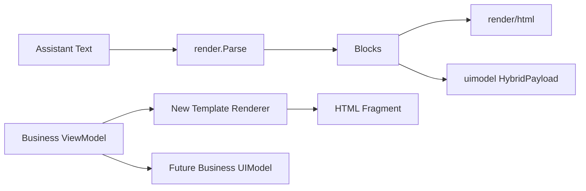

# 2026-04-25 digeino 模板渲染层上提执行方案

## 目标边界

本次升级建议分两期推进。一期先落地“view model -> HTML 片段”的 Go 模板渲染 API，解决业务项目重复维护模板加载、缓存、函数注入、错误分类的问题；二期再扩展 UIModel schema 与跨端渲染器。

现有 `pkg/render` 已经承担“助手文本 -> `[]render.Block` -> HTML / UIModel”的链路，其中 `pkg/render/html` 负责 Block 到 HTML，`pkg/render/uimodel` 负责 Block 到卡片 JSON。新增模板能力不应改变这些接口，避免破坏现有 `Parse -> Markdown -> HTML` 路径。



## 一期：新增模板渲染包

新增 `pkg/render/template` 目录，Go package 建议命名为 `rendertemplate`，避免与标准库 `html/template` 混淆。对外暴露两个核心入口：

```go
RenderTemplate(templateText string, data any, opts TemplateRenderOptions) (string, error)
RenderTemplateFromFile(path string, data any, opts TemplateRenderOptions) (string, error)
```

`TemplateRenderOptions` 建议包含：

- `Funcs map[string]any`：注入业务安全函数，如格式化数字、百分比、标签映射。
- `Cache bool`：文件模板默认可开启缓存；inline 模板只有显式 `CacheKey` 时缓存。
- `CacheKey string`：业务显式缓存键，适合虚拟模板或非文件来源。
- `BaseDir string`：限制相对模板路径解析范围，防止路径逃逸。
- `Strict bool`：启用 `missingkey=error`，模板缺字段时返回执行错误。

实现上使用标准库 `html/template`，默认自动 HTML 转义。`RenderTemplateFromFile` 先解析 `BaseDir` 与模板路径，拿到绝对路径后按 `absPath + modTime + size` 作为默认缓存指纹；缓存结构可用 `sync.Map` 或带锁 map，缓存值为已编译的 `*template.Template`。如果 `Cache=false`，每次直接读取并编译。

## 错误模型

新增可区分的错误类型，例如：

```go
type TemplateErrorKind string

const (
	TemplateErrorNotFound TemplateErrorKind = "not_found"
	TemplateErrorPath     TemplateErrorKind = "path"
	TemplateErrorParse    TemplateErrorKind = "parse"
	TemplateErrorExecute  TemplateErrorKind = "execute"
	TemplateErrorFunc     TemplateErrorKind = "func"
)
```

对外返回 `*TemplateError`，包含 `Kind`、`TemplateName`、`Path` 和底层 `Err`，并实现 `Unwrap()`。业务侧可用 `errors.As` 判断错误类型，从而做降级或回退到本地渲染。

函数注入需要做最小校验：函数名非空、符合模板函数名要求、值非 nil；具体签名错误交给 `html/template` parse/execute 阶段返回。

## 配置与文档

一期不建议把模板配置直接塞进现有 `render:` YAML。当前 `pkg/render/config.go` 的 `RenderConfig` 已明确代表 parse 配置与 Block HTML 呈现配置，强行合并会混淆“助手文本渲染”和“业务模板渲染”。

建议先在文档中约定业务项目自行维护：

- `config/templates/*.tmpl`：模板文件。
- `config/render.yaml` 或独立 CSS：样式策略。
- 业务 service：DTO -> view model。

更新 `pkg/render/README.md`，新增“数据模板渲染”章节，明确它与 `pkg/render/html` 的区别，并给出 DigStockAgent 类似调用示例。

## 测试计划

新增 `pkg/render/template` 单元测试，覆盖：

- 默认转义：`<script>` 等动态文本被 escape。
- `Strict=true`：缺字段返回 `TemplateErrorExecute`。
- `Funcs`：合法函数可用，非法函数返回 `TemplateErrorFunc` 或 parse 错误。
- 文件加载：相对路径 + `BaseDir` 正常解析。
- 路径安全：`../` 逃逸 `BaseDir` 时拒绝。
- 缓存：同一文件缓存命中；文件 `mtime/size` 改变后重新编译。
- inline 模板：不带 `CacheKey` 不缓存，带 `CacheKey` 可缓存。

执行验证建议跑：

```bash
go test ./pkg/render/...
```

如新增包不依赖 Eino，继续保持 `pkg/render` 与 `pkg/render/html` 零 `cloudwego/eino` 依赖的约束。

## 二期：UIModel-first 扩展

当前 `pkg/render/uimodel` 的 `UIModel` 只表达 Block 派生的 `cards`，`BuildUIModel` 也只处理 `markdown`、`thinking`、`code` 三种 block。二期可以新增更通用的业务 UIModel schema，例如 `card`、`list`、`table`、`grid`、`meta`，让 Go 服务输出结构化 JSON，再由 React/Vue 渲染器消费。

二期建议拆成独立提案，不与一期模板渲染混在一个 PR 中：

- 定义 `BusinessUIModel` 或升级现有 `UIModel` 的 schema 版本。
- 提供 JSON schema / 示例 fixture，保障跨端契约稳定。
- 提供 React/Vue 参考渲染器或最小 demo。
- 保留 `HybridPayload` 的 `blocks` 回退策略，避免前端一次性迁移。

## 迁移与回退

业务项目接入时先保留本地模板渲染开关。灰度阶段按配置选择本地实现或 DigEino `RenderTemplateFromFile`；输出结果通过 golden HTML 或快照对比，确认策略师卡片 `strategist_html` 与现有输出一致后，再删除项目内重复模板加载和缓存代码。

回退路径保持简单：业务配置切回本地渲染实现，不影响 DigEino 现有 Block HTML 与 UIModel 输出。
