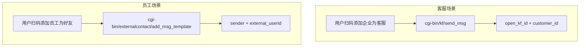

# 企业微信员工发给客户消息 - 实现方案

## 一、chatgpt-wechat-main 调研结论

**chatgpt-wechat-main 未实现该功能。** 其仅包含：

- **客服消息**：`SendCustomerChatMessage(openKfID, customerID, msg)`，使用 `cgi-bin/kf/send_msg`，面向「用户添加企业为客服」的场景
- **应用消息**：`SendToWeComUser(agentID, userID, msg)`，面向企业成员
- **GetCustomerList**：获取客服账号列表 (`kf/account/list`)，不是外部联系人列表

无任何 `externalcontact`、`external_contact`、客户联系相关服务端实现。

---

## 二、企业微信两种「发给个人微信」场景对比



| 维度     | 客服消息（已实现）      | 员工发客户（待实现）                          |
| -------- | ----------------------- | --------------------------------------------- |
| 添加方式 | 用户添加企业为客服      | 用户添加员工为好友                            |
| API      | `cgi-bin/kf/send_msg`   | `cgi-bin/externalcontact/add_msg_template` 等 |
| 凭证     | 应用 ManageAllKFSession | **客户联系 secret**                           |
| 参数     | open_kf_id, customer_id | sender (员工 userid), external_userid         |
| **多轮对话** | 支持 | 不支持 |
| **限制** | 用户发消息后 48 小时内最多回复 5 条，用户续发可再回复 | 每位客户每天最多 1 条，单向群发 |

### 2.1 多轮对话与限制说明

**客服消息**（`kf/send_msg`）支持多轮对话：用户主动发消息后 48 小时内，企业可回复最多 5 条；用户继续发消息可再次回复。适合对话式客服场景。

**员工发客户**（`add_msg_template`）不支持多轮：无论单独发 1 个还是群发多个，都走群发流程，受「每位客户每天 1 条」限制，是单向群发，非对话模式。企业微信目前没有服务端「员工-客户单聊即时发送」API。

**多轮对话的实现**：真正的多轮需员工在企微客户端与客户聊天，或通过「聊天工具栏」等客户端接口，无服务端 API。

### 2.2 chatgpt-wechat-main 对客服消息限制的处理

chatgpt-wechat-main 实现了客服消息，其处理方式如下：

- **48 小时**：无显式校验。回复均由用户消息触发（`DealUserLastMessageByToken` → `CustomerCallLogic`），用户发新消息即刷新 48 小时窗口，天然满足。
- **5 条**：有意识规避，但无条数统计。做法包括：
  - 注释「我们已经收到了您的请求正在处理中...」「语音识别成功」等中间提示，减少冗余消息
  - 客服消息不开启 debug 模式（代码注释：`客服消息不开启 debug 模式，因为响应条数 5条的限制`）
  - 流式回复仍会拆分长文本为多条发送，超 5 条时可能被企微拒绝，无显式计数或截断

---

## 三、企业微信官方能力

### 1. 服务端 API（推荐）

**创建企业群发**（path 92698）：

- 接口：`POST /cgi-bin/externalcontact/add_msg_template`
- 用途：创建群发任务，指定成员向其客户发送消息
- 权限：需「客户联系」功能及对应 secret

流程：

1. 调用 `add_msg_template` 创建群发任务（含 sender、external_userid、消息内容）
2. 调用 `get_groupmsg_list_v2` 获取任务状态
3. 可选：`send_groupmsg` 提醒成员发送

### 2. 客户联系 Secret 获取

- 路径：企业微信管理后台 → 客户联系 → 客户 → API
- 字段：客户联系 Secret（与自建应用 Secret 不同）
- 用于获取 `externalcontact` 专用 access_token

### 3. external_userid 获取

- 接口：`GET /cgi-bin/externalcontact/list`（按员工 userid 获取其客户列表）
- 返回：external_userid 列表
- 需事先配置：成员具备客户联系权限，且客户已添加该成员

---

## 四、DigEino 实现方案

### 1. 新增配置

在 `config/config.yaml` 的 `WeCom` 下增加：

```yaml
WeCom:
  # ... 现有配置 ...
  ExternalContactSecret: ""   # 客户联系 secret（客户联系 > 客户 > API）
```

或在 `Applications` 中扩展：

```yaml
Applications:
  - AgentID: 0
    AgentSecret: ""
    ManageAllKFSession: false
    ExternalContact: false     # 新增：是否具备客户联系权限
  # 或单独配置客户联系 secret
  ExternalContactSecret: ""   # 客户联系专用 secret
```

### 2. 新增类型（wx_types.go）

```go
// SendWeComExternalContactMessageRequest 员工单独发给单个客户的请求
type SendWeComExternalContactMessageRequest struct {
    Sender          string `json:"sender"`           // 员工 userid
    ExternalUserID  string `json:"external_userid"`  // 外部联系人 ID（客户），单个
    Content         string `json:"content"`          // 文字内容
    AccessToken     string `json:"access_token"`     // 可选：第三方传入
}

// SendWeComExternalContactBroadcastRequest 员工群发给多个客户的请求
type SendWeComExternalContactBroadcastRequest struct {
    Sender           string   `json:"sender"`            // 员工 userid
    ExternalUserIDs  []string `json:"external_userids"` // 外部联系人 ID 列表（客户）
    Content          string   `json:"content"`          // 文字内容
    AccessToken      string   `json:"access_token"`     // 可选：第三方传入
}
```

### 3. 新增 API 调用（wecom_message.go）

- 实现 `getExternalContactAccessToken()`：用 `ExternalContactSecret` 获取 token
- 实现 `SendWeComExternalContactMessage()`：单独发送，调用 `add_msg_template`（传 1 个 external_userid）
- 实现 `SendWeComExternalContactBroadcast()`：群发，调用 `add_msg_template`（传多个 external_userid）
- 可选：支持 add_msg_template 的异步流程（任务创建 → 状态查询）

### 4. 新增工具（wecom_tool.go）

| 工具名 | 用途 | 参数 |
|--------|------|------|
| `send_wecom_external_contact_message` | 单独发送 | sender, external_userid （单个）, content |
| `send_wecom_external_contact_broadcast` | 群发 | sender, external_userids （数组）, content |

**工具一：单独发送**

```go
func NewWeComExternalContactMessageTool(ctx context.Context) (tool.BaseTool, error)
```

- 工具名：`send_wecom_external_contact_message`
- 描述：通过企业微信客户联系，由指定员工向**单个**已添加该员工的客户发送文字消息

**工具二：群发**

```go
func NewWeComExternalContactBroadcastTool(ctx context.Context) (tool.BaseTool, error)
```

- 工具名：`send_wecom_external_contact_broadcast`
- 描述：通过企业微信客户联系，由指定员工向**多个**已添加该员工的客户群发文字消息

### 5. 可选能力

- 获取员工客户列表：`GET /cgi-bin/externalcontact/list?userid=xxx`

---

## 五、实现注意事项

1. **go-workwx 支持**：需确认 whyiyhw/go-workwx 或 xen0n/go-workwx 是否封装 `externalcontact`；若无，需手写 HTTP 请求。
2. **限制**：同一成员对同一客户每日群发上限 1 条，需做限频或提示。
3. **external_userid 获取**：调用方需已有 external_userid；可考虑增加「获取员工客户列表」工具供上游使用。
4. **权限**：成员需开通客户联系，且客户需已添加该成员。
5. **两工具共用**：单独发送与群发共用 `add_msg_template`，仅 external_userid 数量不同。

---

## 六、建议实施顺序

1. 配置 `ExternalContactSecret` 与相关结构体
2. 实现 externalcontact 的 access_token 获取
3. 实现 `add_msg_template` 调用（先支持文字）
4. 新增 `SendWeComExternalContactMessage` 与 `SendWeComExternalContactBroadcast`，及对应两个 tool
5. 在 `tools.go` 中注册两个工具
6. 编写文档与测试说明
